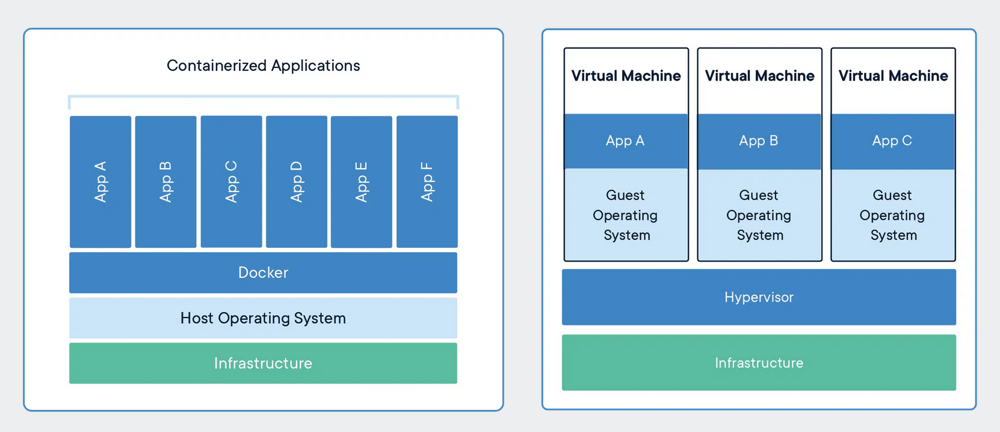
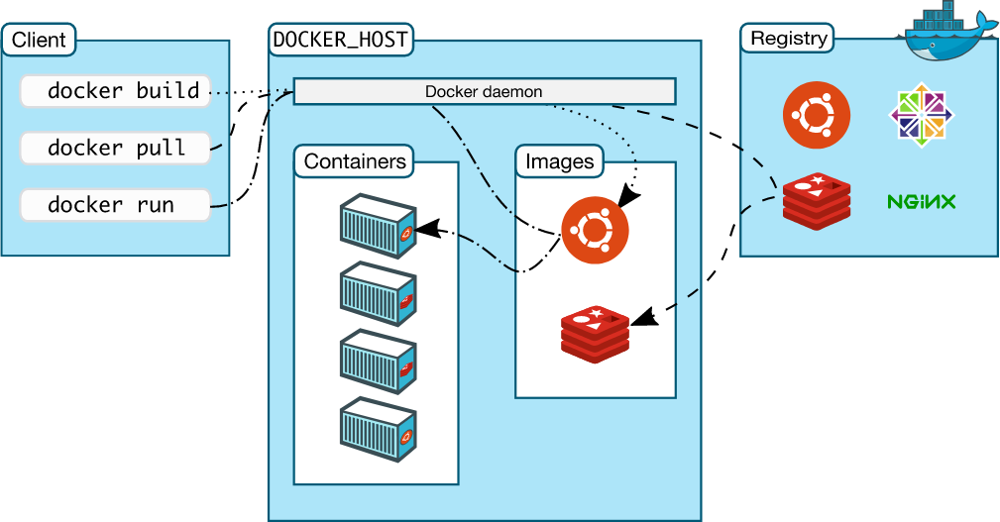

1. Pre-requisites before learning Docker -> Virtual Machine, Hypervisor.

2. Containers => A container is a standard unit of software that packages up code and all its dependencies so the application runs quickly and reliably from one computing environment to another. A Docker container image is a lightweight, standalone, executable package of software that includes everything needed to run an application: code, runtime, system tools, system libraries and settings.
A container is a bundle of Application, Application libraries required to run the application and the minimum system dependencies.

3. Containers vs Virtual Machine => Containers and virtual machines are both technologies used to isolate applications and their dependencies, but they have some key differences:
    i) Resource Utilization: Containers share the host operating system kernel, making them lighter and faster than VMs. VMs have a full-fledged OS and hypervisor, making them more resource-intensive.
    ii) Portability: Containers are designed to be portable and can run on any system with a compatible host operating system. VMs are less portable as they need a compatible hypervisor to run.
    iii) Security: VMs provide a higher level of security as each VM has its own operating system and can be isolated from the host and other VMs. Containers provide less isolation, as they share the host operating system.
    iv) Management: Managing containers is typically easier than managing VMs, as containers are designed to be lightweight and fast-moving.

4. Why are containers light weight?
    Containers are lightweight because they use a technology called containerization, which allows them to share the host operating system's kernel and libraries, while still providing isolation for the application and its dependencies. This results in a smaller footprint compared to traditional virtual machines, as the containers do not need to include a full operating system. Additionally, Docker containers are designed to be minimal, only including what is necessary for the application to run, further reducing their size.

5. Files and folders in container's base images.
    i)   /bin: contains binary executable files, such as the ls, cp, and ps commands.
    ii)  /sbin: contains system binary executable files, such as the init and shutdown commands.
    iii) /etc: contains configuration files for various system services.
    iv)  /lib: contains library files that are used by the binary executables.
    v)   /usr: contains user-related files and utilities, such as applications, libraries, and documentation.
    vi)  /var: contains variable data, such as log files, spool files, and temporary files.
    vii)  /root: is the home directory of the root user.

6. Files and folders that container's use from the host operating system.
    i)   The host's file system: Docker containers can access the host file system using bind mounts, which allow the container to read and write files in the host file system.
    ii)  Networking stack: The host's networking stack is used to provide network connectivity to the container. Docker containers can be connected to the host's network directly or through a virtual network.
    iii) System calls: The host's kernel handles system calls from the container, which is how the container accesses the host's resources, such as CPU, memory, and I/O.
    iv)  Namespaces: Docker containers use Linux namespaces to create isolated environments for the container's processes. Namespaces provide isolation for resources such as the file system, process ID, and network.
    v)   Control groups (cgroups): Docker containers use cgroups to limit and control the amount of resources, such as CPU, memory, and I/O, that a container can access.

7.  It's important to note that while a container uses resources from the host operating system, it is still isolated from the host and other containers, so changes to the container do not affect the host or other containers.
So, in a nutshell, container base images are typically smaller compared to VM images because they are designed to be minimalist and only contain the necessary components for running a specific application or service. VMs, on the other hand, emulate an entire operating system, including all its libraries, utilities, and system files, resulting in a much larger size.

8. What is Docker? => Docker is a containerization platform that provides easy way to containerize the applications, which means, using Docker one can build container images, run the images to create containers and also push these containers to container regestries such as DockerHub, Quay.io and so on.
In simple words, we can understand as containerization is a concept or technology and Docker Implements Containerization.

9. Docker Architechture => The architechture is best described in the attached image. 

10. Docker Lifecycle => The Docker lifecycle is best described in the 3 points below.
    i) docker build -> builds docker images from Dockerfile.
    ii) docker run -> runs container from docker images.
    iii) docker push -> push the container image to public/private regestries to share the docker images.

11. Some of the very important docker terminologies are mentioned below.
    i) Docker Daemon => The Docker daemon (dockerd) listens for Docker API requests and manages Docker objects such as images, containers, networks, and volumes. A daemon can also communicate with other daemons to manage Docker services.
    
    ii) Docker Client => The Docker client (docker) is the primary way that many Docker users interact with Docker. When we use commands such as docker run, the client sends these commands to dockerd, which carries them out. The docker command uses the Docker API. The Docker client can communicate with more than one daemon.

    iii) Docker Desktop => Docker Desktop is an easy-to-install application for our Mac, Windows or Linux environment that enables us to build and share containerized applications and microservices. Docker Desktop includes the Docker daemon (dockerd), the Docker client (docker), Docker Compose, Docker Content Trust, Kubernetes, and Credential Helper.

    iv) Docker Registries => A Docker registry stores Docker images. Docker Hub is a public registry that anyone can use, and Docker is configured to look for images on Docker Hub by default. One can even run our own private registry.
    When we use the docker pull or docker run commands, the required images are pulled from our configured registry. When we use the docker push command, our image is pushed to our configured registry. Docker objects   
    When we use Docker, we are creating and using images, containers, networks, volumes, plugins, and other objects. This section is a brief overview of some of those objects.

    v) Dockerfile => Dockerfile is a file where we provide the steps to build our Docker Image.

    vi) Images => An image is a read-only template with instructions for creating a Docker container. Often, an image is based on another image, with some additional customization. For example, one may build an image which is based on the ubuntu image, but installs the Apache web server and our application, as well as the configuration details needed to make our application run.
    We might create our own images or we might only use those created by others and published in a registry. To build our own image, we create a Dockerfile with a simple syntax for defining the steps needed to create the image and run it. Each instruction in a Dockerfile creates a layer in the image. When we change the Dockerfile and rebuild the image, only those layers which have changed are rebuilt. This is part of what makes images so lightweight, small, and fast, when compared to other virtualization technologies.

12. Docker Volumes => The purpose of using Docker volumes is to persist data outside the container so it can be backed up or shared.
    Docker volumes are dependent on Docker’s file system and are the preferred method of persisting data for Docker containers and services. When a container is started, Docker loads the read-only image layer, adds a read-write layer on top of the image stack, and mounts volumes onto the container filesystem.

13. Docker Bind Mounts => Bind mounts have been around since the early days of Docker. Bind mounts have limited functionality compared to   volumes. When we use a bind mount, a file or directory on the host machine is mounted into a container. The file or directory is referenced by its absolute path on the host machine.
    Using volumes is the easiest way to begin persisting data in our Docker container. Overall, bind mounts are more limited in comparison. One of the key differentiators of a bind mount is that a bind mount can be accessed and modified by processes outside Docker.

14. Docker tmpfs mounts => Volumes and bind mounts let us share files between the host machine and container so that one can persist data even after the container is stopped.
If we running Docker on Linux, we have a third option: tmpfs mounts. When we create a container with a tmpfs mount, the container can create files outside the container's writable layer.

15. Docker Networking => There are basically 3 types of networking in docker namely Bridge, Host and Overlay.
    i) Bridge Networking => The bridge is a default network where containers will be created by default if we have not mentioned any network while creating. The containers which are deployed in the same network can talk to each other the containers which are not in the same network can’t communicate with each other without proper mentions and permissions. 

    ii) Host Networking => A networking mode in which a Docker container shares its network namespace with the host machine. The application inside the container can be accessed using a port at the host's IP address (e.g., port 80). Docker network host can offer performance improvements and optimizations over other Docker networking modes.

    iii) Overlay Networking => Not much required from Docker pespective, required with Docker Swarm, Kubernetes.